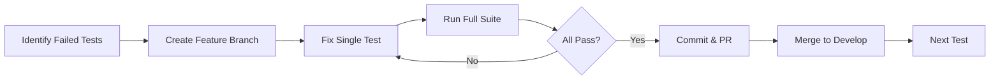

# Development Notes

## Test Strategy

### Incremental Test Resolution
1. Disable all failing tests temporarily with `@pytest.mark.skip`
2. Create feature branch for each test fix: `git checkout -b fix/test-name`
3. Re-enable and fix one test at a time
4. Ensure 100% pass rate after each fix
5. Commit changes with semantic commit message
6. Create PR and merge back to develop
7. Repeat for next test

### Test Progress Workflow


## Current Status (2025-01-19)

### Completed Tasks
1. Fixed critical violations tests
2. Implemented test automation framework
3. Completed full verification tests
4. Set up coverage reporting
5. Cleaned up git branches

### Next Steps
1. Implement remaining tests in order:
   - [ ] Compliance checking
   - [ ] Dependency analysis
   - [ ] Safety validation
   - [ ] Security analysis
   - [ ] Style analysis

2. Coverage goals:
   - [ ] Core modules: 95%
   - [ ] Utilities: 90%
   - [ ] Integration tests: 85%

3. Documentation:
   - [ ] Update API documentation
   - [ ] Add more usage examples
   - [ ] Complete tutorial series

## Useful Commands

### Project Structure
```bash
# Generate project structure tree (excluding build artifacts)
tree -I 'node_modules|venv|.git|__pycache__|.coverage' --dirsfirst > tree.txt
```

### Git Workflow
```bash
# Create new feature branch
git checkout -b fix/test-name

# Check test status
pytest tests/test_name.py -v

# Commit changes
git commit -m "test: fix test_name implementation"

# Update develop
git checkout develop
git merge --no-ff fix/test-name
git push origin develop
```

## Branch Status
- develop: main development branch
- main: production releases
- fix/*: test and bug fixes (cleaned)
- feature/*: new features
