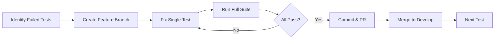

# Development Notes

## Test Strategy

### Incremental Test Resolution
1. Disable all failing tests temporarily with `@pytest.mark.skip`
2. Create feature branch for each test fix: `git checkout -b fix/test-name`
3. Re-enable and fix one test at a time
4. Ensure 100% pass rate after each fix
5. Commit changes with semantic commit message
6. Create PR and merge back to develop
7. Repeat for next test

### Test Progress Workflow


## Implementation Strategy

### Core Components

1. Code Change Validator
```python
# src/core/validator.py
class CodeChangeValidator:
    def validate(self, change: CodeChange) -> ValidationResult:
        """Validate code changes in real-time."""
        pass

    def enforce_rules(self, action: CodeAction) -> bool:
        """Enforce safety rules on code actions."""
        pass
```

2. IDE Integration
```typescript
// src/ide/vscode/extension.ts
export class SafetyExtension {
    onCodeChange(event: ChangeEvent) {
        // Intercept changes
        // Validate using core
        // Show UI feedback
    }
}
```

3. CI/CD Integration
```yaml
# .github/workflows/safety-check.yml
name: Safety Check
on: [pull_request]
jobs:
  validate:
    runs-on: ubuntu-latest
    steps:
      - uses: actions/checkout@v2
      - uses: sacp/safety-check-action@v1
```

### Development Process

1. TDD Workflow
```bash
# 1. Create feature branch
git checkout -b feature/validator-core

# 2. Write failing test
vim tests/test_validator.py

# 3. Run tests (should fail)
pytest tests/test_validator.py -v

# 4. Implement feature
vim src/core/validator.py

# 5. Run tests (should pass)
pytest tests/test_validator.py -v

# 6. Commit
git commit -m "feat: implement code change validator"
```

## Current Status (2025-01-19)

### Completed Tasks
1. Fixed critical violations tests
2. Implemented test automation framework
3. Completed full verification tests
4. Set up coverage reporting
5. Cleaned up git branches

### Next Steps
1. Implement remaining tests in order:
   - [ ] Compliance checking
   - [ ] Dependency analysis
   - [ ] Safety validation
   - [ ] Security analysis
   - [ ] Style analysis

2. Coverage goals:
   - [ ] Core modules: 95%
   - [ ] Utilities: 90%
   - [ ] Integration tests: 85%

3. Documentation:
   - [ ] Update API documentation
   - [ ] Add more usage examples
   - [ ] Complete tutorial series

## Useful Commands

### Project Structure
```bash
# Generate project structure tree (excluding build artifacts)
tree -I 'node_modules|venv|.git|__pycache__|.coverage' --dirsfirst > tree.txt
```

### Git Workflow
```bash
# Create new feature branch
git checkout -b fix/test-name

# Check test status
pytest tests/test_name.py -v

# Commit changes
git commit -m "test: fix test_name implementation"

# Update develop
git checkout develop
git merge --no-ff fix/test-name
git push origin develop
```

## Branch Status
- develop: main development branch
- main: production releases
- fix/*: test and bug fixes (cleaned)
- feature/*: new features
