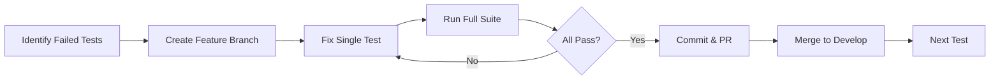

# Development Notes

## Test Strategy

### Incremental Test Resolution
1. Disable all failing tests temporarily with `@pytest.mark.skip`
2. Create feature branch for each test fix: `git checkout -b fix/test-name`
3. Re-enable and fix one test at a time
4. Ensure 100% pass rate after each fix
5. Commit changes with semantic commit message
6. Create PR and merge back to develop
7. Repeat for next test

### Test Progress Workflow


## Useful Commands

### Project Structure
```bash
# Generate project structure tree (excluding build artifacts)
tree -I 'node_modules|venv|.git|__pycache__|.coverage' --dirsfirst > tree.txt
```

## Test Status
- [x] test_critical_violations
- [x] test_test_automation
- [x] test_full_verification
- [ ] test_compliance_checking
- [ ] test_dependency_analyzer
- [ ] test_formal_verification
- [ ] test_property_validation
- [ ] test_safety_validator
- [ ] test_security_analysis
- [ ] test_static_analysis

## Current Tasks
1. Complete remaining test implementations
2. Clean up style analysis branches
3. Improve test coverage

## Git Branches
- develop: main development branch
- fix/*: test and bug fixes
- feature/*: new features
